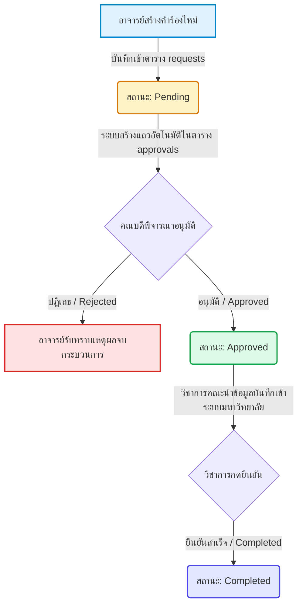

# เอกสารอธิบายวิธีการทำงานของระบบ (RSMS System Workflow)

เอกสารนี้จัดทำขึ้นเพื่ออธิบาย **วิธีการทำงานและสถาปัตยกรรมของโปรเจกต์ ระบบคำร้องขอเช็กอินย้อนหลัง (RSMS)** ทั้งขั้นตอนการใช้งานจริงของผู้ใช้งาน (User Workflow) และการทำงานของระบบโปรแกรมเบื้องหลัง (Technical Workflow)

---

## 1. บทบาทของผู้ใช้ในระบบ (Roles & Permissions)

ระบบแบ่งออกเป็น 5 บทบาทหลัก เพื่อสะท้อนการทำงานจริงในระดับมหาวิทยาลัย:

| บทบาทผู้ใช้ (Role) | สิทธิ์และหน้าที่หลักในระบบ |
| :--- | :--- |
| **Teacher (อาจารย์ผู้สอน)** | เขียนส่งคำร้องเช็กอินย้อนหลัง, แนบหลักฐาน (เช่น รูปภาพ), ดูสถานะคำร้องของตนเอง |
| **Dean (คณบดี)** | เข้าถึงเมนู **"อนุมัติคำร้อง"** เพื่ออนุมัติ/ปฏิเสธ คำร้องของอาจารย์เฉพาะในสังกัดคณะตนเองเท่านั้น |
| **Academic (ฝ่ายวิชาการคณะ)** | เข้าถึงคำร้องที่อนุมัติแล้ว เพื่อกดยืนยัน (Complete) หลังจากนำผลไปบันทึกเข้าระบบส่วนกลางเรียบร้อย |
| **Director (ผู้อำนวยการ)** | ดูรายงาน สถิติ แดชบอร์ดสรุป และหน้าประวัติคำร้องทั้งหมดของทุกคณะในมหาวิทยาลัย |
| **Admin (ผู้ดูแลระบบ)** | สิทธิ์สูงสุดในการเข้าถึงทุกเมนู และเป็นผู้จัดการเพิ่ม/แก้ไข/ลบ รายชื่อผู้ใช้งาน คณะ และจัดการบทบาท (Roles) |

---

## 2. ขั้นตอนและวงจรการทำงานของคำร้อง (Request Status Flow)

การส่งคำร้องและพิจารณาอนุมัติจะมีสถานะเปลี่ยนผ่านตามลำดับ (Flow) ดังแผนภาพด้านล่างนี้:



### รายละเอียดการเปลี่ยนสถานะในแต่ละขั้น:

1. **การสร้างคำร้อง (Create Request):**
   - อาจารย์กรอกข้อมูลในหน้าบ้าน (เช่น รหัสวิชา, กลุ่มเรียน, วันที่สอน, ปัญหาที่พบ, เหตุผล และหลักฐานแนบ)
   - หน้าบ้านยิง API `POST /api/requests`
   - เมื่อบันทึกลงฐานข้อมูล ระบบจะสร้างเลขที่คำร้องขึ้นต้นด้วย `REQ-XXXXXX` และเซ็ตสถานะเริ่มต้นในใบอนุมัติเป็น **`Pending` (รอพิจารณา)**

2. **การพิจารณาอนุมัติโดยคณบดี (Dean Review):**
   - คณบดีของคณะนั้นๆ เข้ามาตรวจสอบข้อมูลรายละเอียดคำร้องพร้อมเอกสารแนบ
   - **กรณีปฏิเสธ (Rejected):** คณบดีป้อนโน้ตเหตุผล และกดปฏิเสธ คำร้องจะสิ้นสุดการดำเนินงานทันที
   - **กรณีอนุมัติ (Approved):** สถานะคำร้องจะถูกปรับเปลี่ยนเป็น **`Approved` (อนุมัติแล้ว)**

3. **การบันทึกเข้าระบบจริงโดยฝ่ายวิชาการ (Academic Confirmation):**
   - ฝ่ายวิชาการคณะจะเข้ามาดูเฉพาะรายการคำร้องที่ขึ้นสถานะ `Approved`
   - ฝ่ายวิชาการจะนำข้อมูลการเช็กอินย้อนหลังนี้ป้อนเข้าระบบฐานข้อมูลการเช็กชื่อส่วนกลางจริงของมหาวิทยาลัย
   - เมื่อลงระบบจริงเสร็จสิ้น ฝ่ายวิชาการจะกดปุ่ม **"ยืนยันเช็กอิน"** บนหน้าเว็บ เพื่อเซ็ตสถานะเป็น **`Completed` (เสร็จสมบูรณ์)** เพื่อปิดเคสคำร้องนั้นๆ

---

## 3. การทำงานเบื้องหลังทางเทคนิค (Behind the Scenes)

ระบบทำงานร่วมกันแบบ **3-Tier Architecture** ประกอบด้วยหน้าบ้าน, หลังบ้าน และฐานข้อมูลคลาวด์:

```
[ Frontend: React SPA ]  <--->  [ Backend: Express API ]  <--->  [ Database: Supabase (PostgreSQL) ]
```

### A. ฝั่งฐานข้อมูล (Database Automation via Triggers)
ระบบใช้ความสามารถของฐานข้อมูล PostgreSQL บน Supabase เพื่อทำระบบอัตโนมัติ:
- **Trigger `trigger_auto_create_approval`:** เมื่อมีการแทรกแถวข้อมูล (Insert) ใหม่ในตาราง `requests` ตัวฐานข้อมูลจะประมวลผลฟังก์ชัน `auto_create_approval()` เพื่อสร้างแถวรออนุมัติที่มีรหัสเชื่อมโยงกันลงในตาราง `approvals` ให้โดยอัตโนมัติทันที
- **Row Level Security (RLS):** ตารางต่าง ๆ ปิด RLS ไว้ในระบบทดสอบเพื่อให้ตัว Backend สามารถคิวรีข้อมูลได้อย่างรวดเร็ว

### B. ระบบแจ้งเตือนทางอีเมล (Email Notification System)
 backend มีการเชื่อมต่อกับ SMTP Server (เช่น Gmail หรือ Resend) เพื่อส่งอีเมลแบบไม่บล็อกการทำงานหลัก (Asynchronous Task):
- **เมื่อส่งคำร้องใหม่:** ระบบจะส่งอีเมลแจ้งเตือนไปยังคณบดีที่ดูแลคณะของอาจารย์ผู้สอนคนนั้น ๆ เพื่อให้เข้ามาเปิดอนุมัติคำร้อง
- **เมื่อผลอนุมัติเสร็จสิ้น:** ระบบจะส่งอีเมลแจ้งอาจารย์ผู้ยื่นคำร้องทันทีว่าคำขอได้รับสิทธิ์การ "อนุมัติ" หรือ "ปฏิเสธ" พร้อมแนบหมายเหตุเหตุผลจากคณบดี

### C. การจัดการเส้นทางและ API (API Endpoints & Routing)
ฝั่ง Frontend เชื่อมต่อกับ Backend ผ่าน API ตัวอย่างเช่น:
- `GET /api/requests` — ดึงข้อมูลคำร้องเพื่อแสดงผลตามสิทธิ์ของผู้ใช้
- `PATCH /api/requests/:id/status` — ใช้เมื่อคณบดีทำการ อนุมัติ/ปฏิเสธ
- `PATCH /api/requests/:id/complete` — ใช้เมื่อฝ่ายวิชาการกดยืนยันการลงระบบเรียบร้อย
